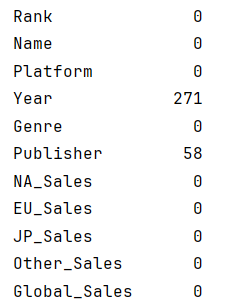

# Global Video Game Sales Analysis
The main objective of this project is to showcase my ability to perform end-to-end data analysis and visualization using Python, with a focus on uncovering meaningful business insights from complex datasets.
Through this project, I demonstrate proficiency in data exploration, trend analysis, and storytelling with data.
These skills are essential in real-world business environments where companies rely on actionable insights to make strategic decisions, particularly in areas like product planning, content investment, and market positioning.

## Tools Used
- Python, pandas, seaborn, matplotlib
- Jupyter Notebook

## 1. Background
In recent years, the global gaming market has seen rapid and sustained growth, with console games, handheld games, and cross-platform titles all flourishing. Competition among major game companies and platforms has become increasingly intense. Industry giants like Nintendo, Sony, and Microsoft continue to dominate large market shares, while emerging platforms and independent game developers are making strong impressions. With innovative gameplay and unique strategies, these newcomers are quickly attracting users and becoming a force to be reckoned with. 

This project is based on global video game sales data compiled from the Kaggle database. It takes a comprehensive look at the competitive landscape of the gaming industry from multiple perspectives, including platform distribution, game genres, regional preferences, and publisher competition. The goal is to identify the key factors behind top-selling games and to uncover user preferences and market trends across different platforms and regions. 

Through this analysis, we aim to provide insights that can help gaming companies refine their market positioning, content strategy, and long-term planning. Ultimately, the goal is to support better alignment between products and player expectations, strengthen market presence, and drive greater commercial success in an increasingly competitive global market. 

## 2. Introduction of Dataset
The source of the dataset is https://www.kaggle.com/datasets/anandshaw2001/video-game-sales, which provides information such as the game’s rank, name, platform, release year, genre, publisher and sales in various regions.

This dataset contains 11 columns and a total of 16600 records:
- **Rank** - Ranking of overall sales
- **Name** - The games name
- **Platform** - Platform of the games release (PC, PS4)
- **Year** - Year of the game’s release
- **Genre** - Genre of the game
- **Publisher** - Publisher of the game
- **NA_Sales** - Sales in North America (in millions)
- **EU_Sales** - Sales in Europe (in millions)
- **JP_Sales** - Sales in Japan (in millions)
- **Other_Sales** - Sales in the rest of the world (in millions)
- **Global_Sales** - Total worldwide sales.

## 3. Data Cleaning and Preprocessing
In data analysis, data cleaning and preprocessing is one of the most crucial steps. So, let’s dive in and get started!
### 3.1 Data Preparation
I start by importing essential Python libraries and loading the dataset into a DataFrame. This ensures that the environment is properly set up for data analysis and visualization.

```python
# Importing necessary libraries and suppressing warnings
import warnings

warnings.filterwarnings('ignore')

import numpy as np
import pandas as pd
import matplotlib

# Use Agg backend if using full matplotlib
matplotlib.use('Agg')
import matplotlib.pyplot as plt
%matplotlib inline

import seaborn as sns

sns.set_style('whitegrid')

# Load the dataset
video_games = pd.read_csv('vgsales.csv')

# Display the first few rows
video_games.head()
```


### 3.2 Data Cleaning
#### 3.2.1 Handle Missing Values
I check for missing values in the dataset and calculate their proportion relative to the entire data. This helps assess whether missing data poses a risk to the analysis. Given that the proportion of missing records is relatively small compared to the overall dataset, I have decided to remove them rather than attempt an imprecise replacement.
```python
video_games.isna().sum()
```

